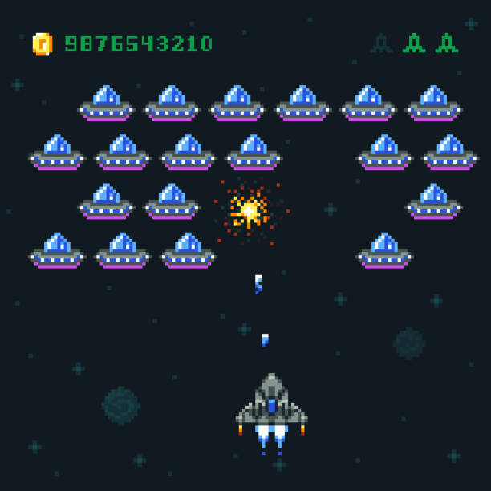
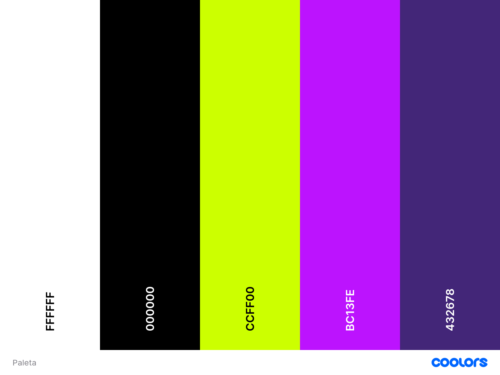
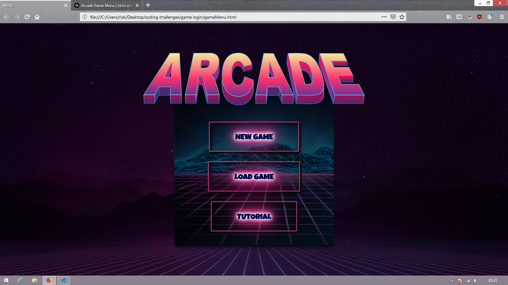
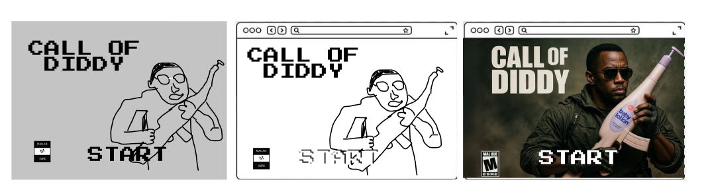
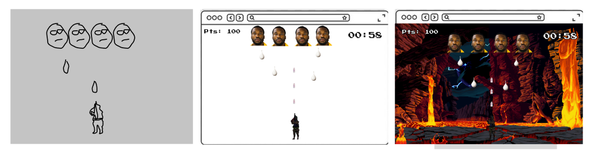
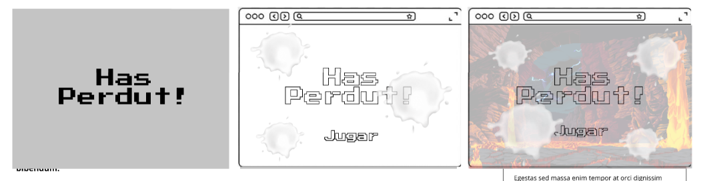
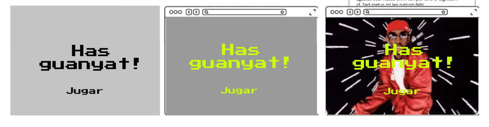
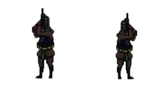
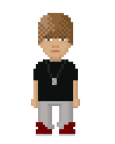
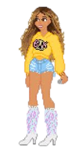

## Projecte-videojoc-Aaron-i-Mike
Aquest és el Markdown sobre el nostre projecte, que tracta sobre fer un videojoc amb JavaScript.  
Per això, primer de tot, entre els membres del grup escollim les diferents característiques visuals que tindrà el nostre videojoc (Tipologia, paleta de colors, wireframe...).

### Menú
- [Tipologia](#tipologia)
- [Paleta de colors](#paleta-de-colors)
- [Tipografia](#tipografia)
- [Wireframe](#wireframe)
- [Sprites](#Sprites)

---

### Tipologia
En aquest apartat expliquem la **tipologia** del nostre videojoc, anomenat **Call of Diddy**, un projecte desenvolupat amb **JavaScript**, **HTML5** i **CSS3**.

El nostre videojoc està inspirat en el clàssic joc d’**arcade de naus espacials**, però amb un toc original i modern. En lloc de controlar una nau, el jugador controla a **Puff Diddy**, un personatge carismàtic que es pot desplaçar lateralment per la pantalla utilitzant les **tecles del teclat**. L’objectiu és **eliminar tants enemics com sigui possible dins d’un temps limitat**.

---

### Tipus d’enemics
Hi haurà **tres tipus diferents d’enemics**, cadascun amb característiques úniques i puntuació diferent:

| Enemic      | Vida      | Punts que suma matar | Punts que resta si et fa mal |
|------------|----------|--------------------|-----------------------------|
| Enemic 1   | Baixa    | +10                | -5                          |
| Enemic 2   | Mitjana  | +20                | -10                         |
| Enemic 3   | Alta     | +30                | -20                         |

---

### Oleades de enemics (waves) amb espais per esquivar
Els enemics **es mostraran en format de fila**, però **no ocuparan totes les posicions**, deixant **espais per que el jugador pugui esquivar**. Cada fila té una **durada limitada**, després de la qual els enemics restants desapareixen i apareix la següent fila.

Exemple de oleades equilibrades:

- **Fila 1 (fàcil):** 4 enemics fàcils espaiats en una fila de 10 posicions, durada 10s  
- **Fila 2 (intermèdia):** 2 enemics mitjans + 2 fàcils espaiats, durada 12s  
- **Fila 3 (difícil):** 3 enemics difícils + 2 mitjans, espaiats, durada 15s  

**Visual simplificat d’una fila de 10 posicions:**

Els espais permeten al jugador **moure's i esquivar els atacs**, afegint estratègia al joc.

X = enemic

Posició: 1 2 3 4 5 6 7 8 9 10  

Enemics: 0 0 0 X 0 X 0 X 0 0  

---

### Sistema de puntuació
- **Puntuació inicial del jugador:** 0  
- **Temps total de partida:** exemple: 60 segons  
- **Puntuació mínima requerida per guanyar:** exemple: 120 punts  

**Mecànica:**  
- **Matar enemics:** el jugador suma punts segons el tipus d’enemic.  
- **Rebre dany:** el jugador perd punts segons el tipus d’enemic.  
- **Final del temps total:** es comprova si la puntuació és ≥ puntuació mínima requerida; si és així, el jugador guanya, si no, perd.

---

### Moviment i disparo del jugador
- El jugador **es mourà amb les tecles de fletxa esquerra i dreta**.  
- Es podrà **disparar amb el clic del ratolí** mentre es mou, sense restriccions.  
- Cada **click genera una bala que es mou recta cap amunt** des de la posició X del jugador.  
- **Sprite del jugador:**  
  - Només cal **una imatge**.  
  - Es pot invertir horitzontalment segons la direcció (esquerra/dreta).  
  - No cal sprite diferent per disparar o estar quiet.  
- Els projectils es dibuixen separats del jugador, mostrant visualment que dispara.

  **Visual simplificat del disparo recte:**

  
Jugador: P

  Bala: |

   
Enemics: X X X

   Fila: 1 2 3 4 5

   
---

### Estratègia i dificultat
- Les oleades amb espais permeten **controlar la dificultat i la densitat d’enemics en pantalla**.  
- El jugador ha de **prioritzar quins enemics atacar** per maximitzar punts i minimitzar penalitzacions.  
- Els enemics difícils apareixen menys i són més perillosos, però recompensen més punts.  
- Els enemics fàcils són ràpids i sumen punts freqüents, mantenint l’acció constant.  
- La combinació de temps de partida, oleades amb espais i puntuació mínima fa que el joc sigui **divertit, equilibrat i estratègic**.

---
**Exemple d'imatge del joc inspirat**

[

---

### Paleta de colors
Per al videojoc **Puff Diddy**, hem triat una paleta de colors inspirada en l’estil **retro arcade**, combinant colors vius i contrastats per mantenir l’acció i la claredat visual durant tota la partida.

- **Fons del joc principal:** S’utilitzarà un **GIF animat**, simulant moviment constant per donar dinamisme i sensació d’acció contínua.

- **Elements principals (Puff Diddy i enemics):** Colors vius i contrastats per destacar-los sobre el fons i facilitar la seva identificació ràpida pel jugador.

- **Textos de puntuació i temps:** Blanc amb contorn negre, estil retro, que assegura una bona llegibilitat sobre fons animats o foscos.

- **Pantalla d’inici:** S’utilitzarà una imatge de fons amb el títol **“Call of Diddy”** i Puff Diddy al centre, convertida a **pixel art** per mantenir coherència retro.  
  El text de **“Start”** serà blanc amb contorn negre.

- **Menú d’instruccions (abans d’iniciar el joc):**  
  - **Fons:** Negre (#000000), per destacar els elements visuals i mantenir l’estil arcade.  
  - **Títol:** Groc neó (#CCFF00), per captar l’atenció del jugador.  
  - **Text:** Morat (#BC13FE) amb contorn més fosc (#432678), per assegurar llegibilitat i estil retro.  
  - **Transicions:** Quan el jugador prem **Start**, es mostrarà aquest menú durant uns segons abans de carregar el joc principal, amb una transició suau.

- **Pantalla “Has perdut”:**  
  - **Fons:** Transparent blanc, amb gotes de color blanc simulant que la “sang” de Puff Diddy.  
  - **Text:** Blanc amb contorn negre, per mantenir llegibilitat i estil retro.

- **Pantalla “Has guanyat”:**  
  - **Fons:** Utilitzarem un gif   
  - **Text:** Blanc amb contorn negre, consistent amb la resta de la interfície.

**Paleta de colors:**

**Imatge d'exemple de menú:**

[

**Fons pantalla d'inici:** 

[

**Fons pantalla del joc:** 

[

---

### Tipografia
En l’apartat de la tipografia hem escollit el tipus de lletra Press Start 2P, una font inspirada en els textos dels videojocs clàssics de les consoles de 8 bits. Aquesta tipografia ens ajuda a transmetre una estètica retro molt marcada, reforçant la temàtica del projecte i transportant l’usuari a l’estil visual dels primers jocs arcade.

A més, el seu disseny pixelat i geomètric encaixa perfectament amb la identitat visual del nostre videojoc, aportant coherència gràfica i reforçant la sensació nostàlgica que volem transmetre. També és una font molt reconeguda dins de l’àmbit gamer, cosa que ens permet aconseguir una connexió immediata amb el públic objectiu.
[

---

### Wireframe
En aquest apartat mostrem l’estructura i el disseny del videojoc.
**Wireframe Pantalla inicial**
[

**Wireframe menú d'instruccions**
[

**Wireframe joc**
[

**Wireframe pantalla "Has perdut"**
[

**Wireframe pantalla "Victoria"**
[

---

### Sprites
En aquest apartat hem afegit els **sprites corresponents al nostre joc Puff Diddy**. Aquests sprites representen visualment el jugador, els enemics i els projectils, permetent que el joc sigui clar, comprensible i estèticament coherent.

**Sprite Jugador**

[

**Sprite enemics**

[

[

[

**Sprite projectil**
[

### Diagfram

